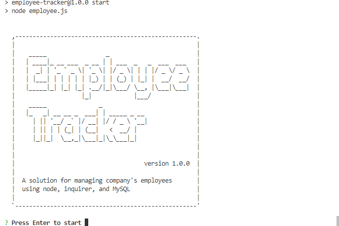

# Employee Tracker

A CLI solution for managing company's employees using node, inquirer, and MySQL.

## Badges

Code quality and validation

Repository Status

License

## Table of contents

- [Employee Tracker](#employee-tracker)
  - [Badges](#badges)
  - [Table of contents](#table-of-contents)
  - [The challenge](#the-challenge)
  - [The development process](#the-development-process)
  - [The Output](#the-output)
  - [Installation and Usage](#installation-and-usage)
  - [Credits, tools and other references](#credits-tools-and-other-references)
  - [Contributing](#contributing)
  - [Questions](#questions)

## The challenge

To architect and build a solution for managing a company's employees using node, inquirer, and MySQL.

Main elements:

- [x] CLI applicacion
- [x] MySQL database
- [x] CRUD model operation

## The development process

In order to accomplish the challenge, the following steps were done:

1. Understand the purpose, concept of the application.
2. Understand the database schemas.
3. Define functionality.
4. Research assets.
5. Develop the functionality.
6. Final review and proper documentation.

## The Output

With the described process we were able to create a useful, efficient and responsive application that ...

**User stories**

1. As a <role> I can <capability>, so that <receive benefit>
2. As a <role> I can <capability>, so that <receive benefit>
3. As a <role> I can <capability>, so that <receive benefit>

**The application**

## Installation and Usage

The project was uploaded to [GitHub](https://github.com/) at the following repository:
[https://github.com/TBM97/EmployeeTracker](https://github.com/TBM97/EmployeeTracker)

You can access the deployed application with the GitHup Pages link:
[https://TBM97.github.io/EmployeeTracker/](https://TBM97.github.io/EmployeeTracker/)

To install the project follow these steps:

1. Step
2. Step
3. Step

## Credits, tools and other references

**Colaborators**

Our appreciation for those who have contributed to the project:

[Name](http:"#")

[Name](http:"#")
<creator><GitHub Profile>

**Third Party Assets**

[Creator](http:"#")
<creator><Primary web presence>

[Balsamiq](https://balsamiq.com/)

[Canvas](https://www.canva.com/)

[Placeholder](https://placeholder.com/)

[Random images](http://lorempixel.com/)

[Lorem Ipsum](www.lipsum.com)

[HTML Color Picker](https://www.w3schools.com/colors/colors_picker.asp)

[Moment.js](https://momentjs.com/)

[CSS Materialize](https://materializecss.com/)

[Bootstrap](https://getbootstrap.com/)

[Test CORS](https://www.test-cors.org/)

[Font Awesome](https://fontawesome.com/)

[Google’s Material Icons](https://google.github.io/material-design-icons/)

[Shields.io](https://shields.io/)

[LGTM](https://lgtm.com/)

[Website Grader](https://website.grader.com/)

[Markup Validation Service](https://validator.w3.org/)

**Tutorials**

[Name](http:"#")
<name><link>

## Contributing

- Pull requests are welcome.
- For major changes, please open an issue first to discuss what you would like to change.
- Please make sure to update tests as appropriate.

## Questions

If you have questions or you want to share comments, we will be glad to hear from you. Please contact me at masonurrabas@gmail.com.

